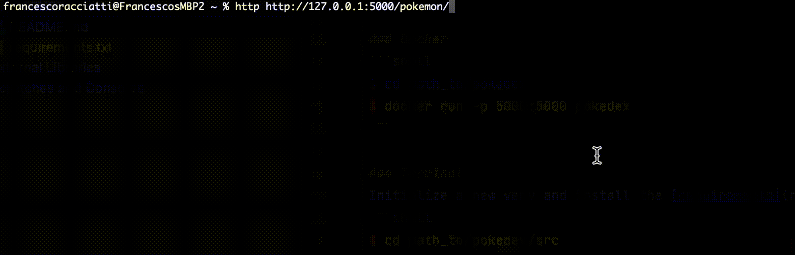

# Pokedex
Pokedex is a micro web server that provides public endpoints to gather information about Pokemon.



Pokedex is implemented in Python3 + Flask and relies on:
 - [PokéApi](https://pokeapi.com) to gather information about Pokemon,
 - [FunTranslations](https://funtranslations.com) to translate descriptions.


# Table Of Contents
- [Running](#running)
  - [Docker](#docker)
  - [Terminal](#terminal)
- [HowTo](#how-to)
- [Endpoints](#endpoints)
  - [Basic Pokemon Information](#basic-pokemon-information)
  - [Translated Pokemon Description](#translated-pokemon-description)
- [Author](#author)
- [License](#license)


## Running
### Docker
By default, the containerized web server runs at `0.0.0.0/6000`.
```shell
$ cd path_to/pokedex
$ docker build --tag pokedex .
$ docker run -p 6000:6000 pokedex
```

### Terminal
Initialize a new venv and install the [requirements](requirements.txt):
```shell
$ cd path_to/pokedex
$ pip install -r requirements.txt
$ pip install -e .
```
Then run:
```shell
$ cd path_to/pokedex/src
$ export FLASK_APP=pokedex
$ flask run --host=0.0.0.0 --port=6000
 ```


# Test
Before running tests, enable Docker Compose V2.
To run tests:
```shell
$ cd path_to/pokedex
$ docker compose up --build --abort-on-container-exit --exit-code-from test-api
 ```
All tests must pass.


## How To
Refer to [HOWTO](HOWTO.md) to find out insights about building, testing, running and customizing Pokedex.


## Endpoints
### Basic Pokemon Information
```
/HTTP/GET /pokemon/<pokemon name>
```
Given a Pokemon name, this endpoint returns its:
 - name,
 - standard description,
 - habitat,
 - legendary status.

Example call and API response:
```
http://localhost:6000/pokemon/mewtwo
```
```json
{
  "name": "mewtwo",
  "description": "It was created by a scientist after years of horrific gene splicing and DNA engineering experiments.",
  "habitat": "rare",
  "isLegendary": "true"
}
```

### Translated Pokemon Description
```
/HTTP/GET /pokemon/translated/<pokemon name>
```
Given a Pokemon name, this endpoint returns its:
 - name,
 - translated description,
 - habitat,
 - legendary status.
 
The description is translated by using:
 - the Yoda translator, if the Pokemon's habitat is `cave`or if it is `legendary`;
 - the Shakespeare translator, otherwise.

If the translation service is not available, it uses the standard description.  
 
Example call and API response:
```
http://localhost:6000/pokemon/translated/mewtwo
```
```json
{
  "name": "mewtwo",
  "description": "Created by a scientist after years of horrific gene splicing and DNA engineering experiments, it was.",
  "habitat": "rare",
  "isLegendary": "true"
}
```


## Author
Francesco Racciatti


## License
This project is licensed under the [MIT license](LICENSE).
